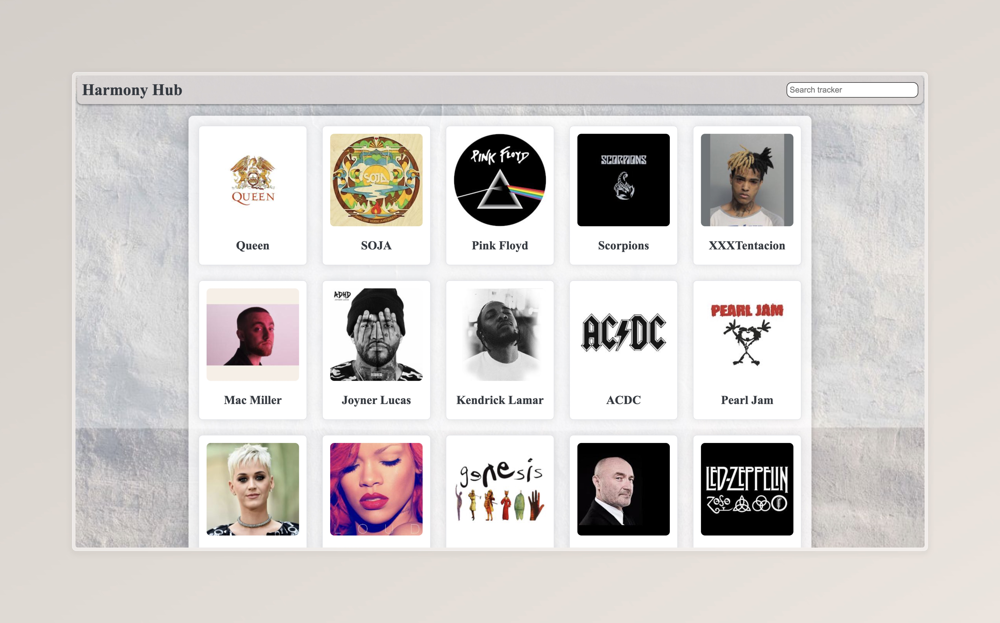
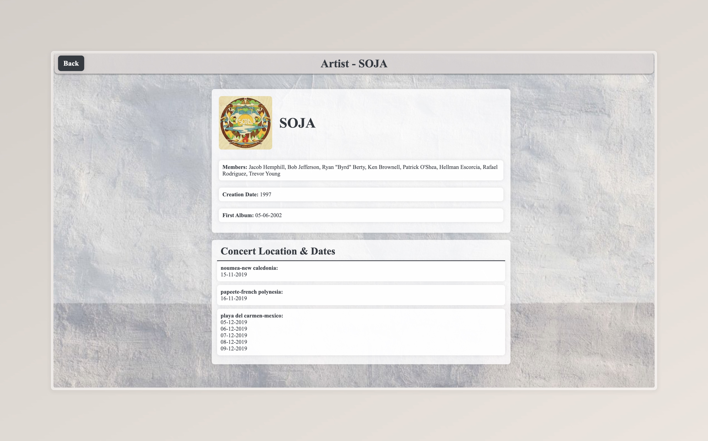
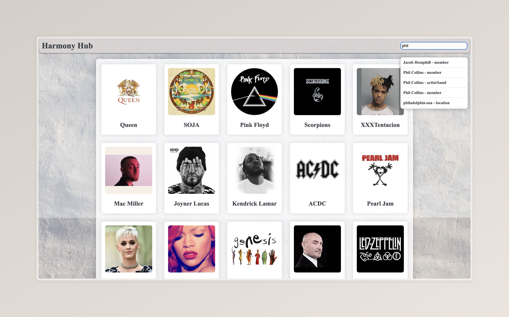

# HarmonyHub

[](https://golang.org/)
[](LICENSE.md)

HarmonyHub is a sophisticated web application built in Go that provides comprehensive information about artists and bands. It aggregates data from external APIs to deliver detailed insights into artist profiles, concert schedules, locations, and more, presented through an intuitive and interactive user interface.

## Features

- **Artist Information**: Detailed profiles including names, images, formation years, first album dates, and member lists.
- **Concert Data**: Upcoming and past concert dates and locations.
- **Interactive Search**: Advanced search functionality with case-insensitive matching, auto-suggestions, and categorized results (e.g., artist names, members, locations, album dates).
- **Responsive Design**: Clean, user-friendly interface with consistent styling and error handling.
- **Error Resilience**: Robust error handling ensuring the application remains stable under various conditions.

## Objectives

The primary goal of HarmonyHub is to process and visualize data from a structured API, creating an engaging web experience. The API provides four key data sets:

1. **Artists**: Core information about bands and artists.
2. **Locations**: Concert venue details.
3. **Dates**: Concert scheduling information.
4. **Relations**: Connections between artists, dates, and locations.

The application employs various data visualization techniques, including cards, tables, and dynamic pages, while emphasizing client-server communication for seamless data retrieval.

## Installation

1. Clone the repository:
   ```bash
   git clone https://github.com/sahmedhusain/harmonyhub.git
   ```
2. Navigate to the project directory:
   ```bash
   cd harmonyhub
   ```
3. Ensure Go is installed (version 1.21 or later).
4. Run the application:
   ```bash
   go run main.go
   ```

## Usage

Once the server is running, open your web browser and navigate to `http://localhost:8080`. The home page displays a list of artists. Use the search bar for quick lookups, or click on an artist for detailed information.

### Search Functionality

- Search by artist/band name, member names, locations, first album date, or creation date.
- Features include case-insensitive matching and typing suggestions with result categorization.
- For example, if you start writing "phil", it should appear as suggestions: Phil Collins - member and Phil Collins - artist/band. This is just an example of a display.

## Screenshots

### Home Page


_Overview of the artist list and search interface._

### Artist Details


_Detailed view of an artist's profile, including concert information._

### Search Results


_Example of search suggestions and results._

## Implementation Details

### Data Fetching

The application fetches data from the provided API endpoints and stores it in structured formats. This includes fetching data about artists, concert dates, locations, and relations. The data is fetched and stored in the Data struct, which is then used to populate the web pages.

### Handlers

The application includes the following handlers:

- **Home Page Handler**: Renders the home page with a list of artists.
- **Artist Page Handler**: Renders a detailed page for a specific artist, including their concert dates and locations.
- **Error Handler**: Handles errors and renders appropriate error pages.

### Templates

The HTML templates for the application are stored in the templates directory and include:

- **index.html**: Template for the home page.
- **artist.html**: Template for the artist details page.
- **error.html**: Template for error pages.

### Error Handling

The application handles various errors, such as invalid URLs, unsupported HTTP methods, and data fetching errors, by displaying appropriate error messages to the user.

### Extensibility and Scalability

The application is designed to be extensible, allowing for the easy addition of new features and improvements. The flexible nature of Go's web framework enables further enhancements.

### Frontend Styling

Style sheets implemented for each page adhere to key usability principles:

- Strive for consistency
- Enable frequent users to use shortcuts
- Offer informative feedback
- Design dialogue to yield closure
- Offer simple error handling
- Permit easy reversal of actions
- Support internal locus of control
- Reduce short-term memory load

## Search Bar

HarmonyHub's search bar provides a functional program that searches within the website for specific text input.

- The program can handle these search cases:

  - artist/band name
  - members
  - locations
  - first album date
  - creation date

- The program can handle search input as case-insensitive.

- The search bar has typing suggestions as you write.

- The search bar can identify and display in each suggestion the individual type of the search cases. (e.g., Freddie Mercury -> member)

## Contributing

Contributions are welcome! Please fork the repository and submit a pull request with your improvements. Ensure code follows Go best practices and includes appropriate tests.

## License

This project is licensed under the MIT License - see the [LICENSE.md](LICENSE.md) file for details.

## Acknowledgments

Built as part of a Go development project, focusing on API integration and web application development.

- For example if you start writing "phil" it should appear as suggestions Phil Collins - member and Phil Collins - artist/band.
  This is just an example of a display.

## Authors

    •	Ali Alqaed
    •	Sayed Ahmed Husain

## API Link

To see an example of the RESTful API used in this project, you can visit [Groupie Tracker API](https://groupietrackers.herokuapp.com/api).

## This project has helped me learn about:

    •	Manipulation and storage of data.
    •	JSON files and format.
    •	HTML.
    •	Event creation and display.
