# HarmonyHub 🎶

[](https://golang.org/)
[](https://developer.mozilla.org/en-US/docs/Web/HTML)
[](https://developer.mozilla.org/en-US/docs/Web/CSS)
[](https://developer.mozilla.org/en-US/docs/Web/JavaScript)
[](LICENSE.md)

<p align="center">
  <strong>Discover artists. Track concerts. Explore music data.</strong><br/>
  <em>A clean Go-powered music discovery experience.</em>
</p>

<!-- 🔗 Quick Navigation -->
<p align="center">
  <a href="#-features">Features</a> •
  <a href="#️-technologies-used">Tech Stack</a> •
  <a href="#-getting-started">Getting Started</a> •
  <a href="#-screenshots">Screenshots</a> •
  <a href="#-application-architecture">Architecture</a>
</p>

---

---

## Overview

**HarmonyHub** is a web application built with **Go**, designed for music lovers and concert enthusiasts. The platform brings together detailed artist profiles, concert locations, and performance dates in a clean and accessible interface.

Users can explore bands, discover upcoming and past shows, and search through artists, members, locations, and dates—all from a single application. HarmonyHub focuses on clarity, performance, and ease of use while working entirely with live API data.

---

## ✨ Features

HarmonyHub provides the following core functionality:

- **Artist Profiles** 📸  
  View detailed information about artists and bands, including formation years, debut albums, and members.

- **Concert Tracking** 📅  
  Access concert dates and locations with structured, real-time data.

- **Smart Search** 🔍 
  Search artists, band members, locations, and dates using an intelligent, case-insensitive search bar with live suggestions.

- **User-Friendly Design** 💻  
  Clean and responsive interface that adapts seamlessly across devices.

- **Reliable Performance** ⚡  
  Graceful error handling and stable server-side processing using Go.

---

## 🛠️ Technologies Used

HarmonyHub is built using the following technologies:

- **Go** 🐹 – Backend server, routing, and data processing  
- **HTML** 🌐 – Page structure and templating  
- **CSS** 🎨 – Responsive styling and layout  
- **JavaScript** ⚙️ – Interactive search and client-side behavior  
- **REST API** 🔄 – External data source for artists and concerts  

<!-- 🧩 Technology Logos -->
<p align="center">
  
  
  
  
</p>

---
---

## 🎯 Project Objective

HarmonyHub processes structured data from an external API to create an intuitive music discovery experience.

### Core Data Entities

1. **Artists** 📸 – Names, images, formation years, first albums, and members  
2. **Locations** 📍 – Concert venues and cities  
3. **Dates** 📅 – Performance schedules  
4. **Relations** 🔗 – Connections between artists, dates, and locations  

Data is visualized using cards, tables, and dynamic UI components rendered through server-side templates.

---

## 🚀 Getting Started

### Prerequisites

- Go version **1.21 or higher**

### Installation & Setup

1. Clone the repository:
   ```bash
   git clone https://github.com/sahmedhusain/harmonyhub.git
   ```

2. Navigate to the project directory:
   ```bash
   cd harmonyhub
   ```

3. Run the application:
   ```bash
   go run main.go
   ```

4. Open your browser and visit:
   ```
   http://localhost:8080
   ```

---

## 📖 How to Use

- Browse the home page to view a list of available artists.
- Click on any artist to access detailed band and concert information.
- Use the search bar to quickly filter results by artist name, band member, location, or date.

### Search Examples

- Typing **"phil"** may return suggestions such as:
  - *Phil Collins – member*
  - *Phil Collins – artist/band*

---

## 📸 Screenshots

### Home Page
  
_Browse artists and access the smart search._

### Artist Details
  
_View band history and concert information._

### Search Results
  
_Live search suggestions and filtered results._

---

## 🛠️ Application Architecture

```mermaid
graph TD;
    User[👤 User] --> Browser[🌐 Browser<br/>HTML/CSS/JS];
    Browser --> Server[🐹 Go Server<br/>Routing & Data Processing];
    Server --> API[🔄 REST API<br/>External Data Source];
    API --> Server;
    Server --> Templates[📄 Templates<br/>Dynamic Views];
    Templates --> Browser;
    Server --> Handlers[⚙️ Handlers<br/>Page Rendering];
    Server --> ErrorManagement[🛡️ Error Management<br/>Stability & Feedback];
    Browser --> Styling[🎨 Styling<br/>Responsive Layout];
    Browser --> JavaScript[⚡ JavaScript<br/>Live Search & Interactions];
```

<!-- 🏗️ Architecture Overview -->
<p align="center">

</p>

### Data Handling

- Fetches and processes API data
- Stores structured data using Go structs for efficiency

### Server-Side

- **Handlers** – Manage routing and page rendering  
- **Templates** – HTML templates for dynamic views  
- **Error Management** – Ensures stability and clear feedback  

### Front-End

- **Styling** – Consistent, responsive layout  
- **JavaScript** – Powers live search and suggestions  

The architecture is designed for scalability and easy feature expansion.

---

## 🔍 Search System Details

The search functionality supports:

- Artist and band names  
- Band members  
- Concert locations  
- Album release dates and creation years  

Additional behavior:
- Case-insensitive input
- Live suggestions while typing
- Clear labeling for each result (e.g., *"Freddie Mercury – member"*)

---

## 🤝 Contributing

Contributions are welcome. Fork the repository, implement improvements, and submit a pull request. Please follow Go best practices and include tests where applicable.

---

## 📄 License

This project is licensed under the **MIT License**. See [LICENSE.md](LICENSE.md) for details.

---

## 🙏 Acknowledgments

Developed as part of a Go learning journey with a focus on API integration and web application development. Credit to the original API providers.

---

## 👥 Authors

- **Ali Alqaed**  
- **Sayed Ahmed Husain** – [sayedahmed97.sad@gmail.com](mailto:sayedahmed97.sad@gmail.com)

---

## 🔗 API Reference

- **Groupie Tracker API**  
  https://groupietrackers.herokuapp.com/api

---

## 📚 What I Learned

- Structuring and handling API-driven data  
- Working with JSON in Go  
- Server-side rendering using templates  
- Building interactive web interfaces  

---

## ✨ Visual & UX Highlights

- Smooth page transitions and responsive layout  
- Clean typography for readability  
- Consistent card-based UI design  
- Live search feedback with instant suggestions  

> Visual assets (banners, GIFs, and diagrams) are intentionally lightweight to keep performance high while improving presentation.
